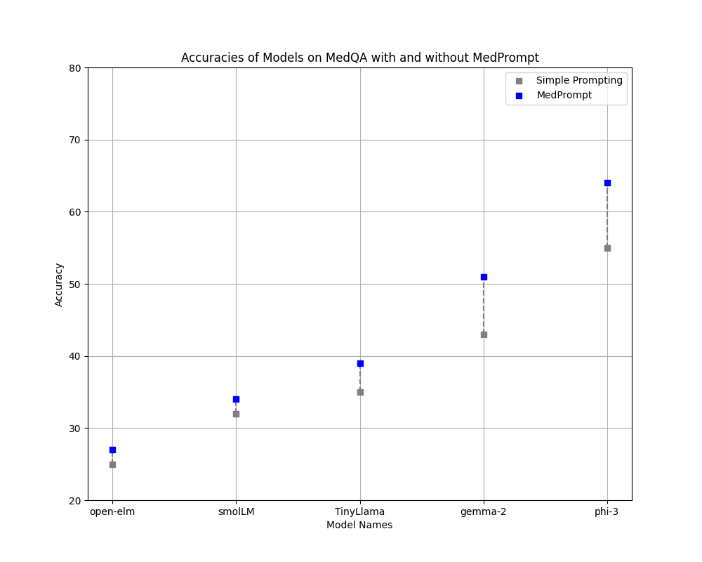

# LLMs for patient information

Patient information through large language models (LLMs) offers real-time, cheap and user-tailored answers to medical questions. However, this information needs to be reliable. The MedPrompt paper introduces a novel technique that improves the performance of LLMs in the medical domain not by fine-tuning the models specifically for healthcare, but by using carefully designed prompts. This method proved highly effective, demonstrating that prompting alone can significantly boost LLM accuracy in medical tasks. Used techniques include Dynamic Few Shot, Ensembling and Chain-of-Thought Reasoning.  

Can Generalist Foundation Models Outcompete Special-Purpose Tuning? Case Study in Medicine
Nori et al. (2023)

## Lighweight mobile LLMs

The `medprompt.ipynb` notebook implements an adaptation of MedPrompt for small LLMs and evaluates them on multiple choice questions from MedQA (`GBaker/MedQA-USMLE-4-options`).

Models considered: 
- microsoft/Phi-3-mini-4k-instruct (3.82B params) (April 2024)
- TinyLlama/TinyLlama-1.1B-Chat-v0.1 (1.1B params) (September 2023)
- apple/OpenELM-3B (3.04B params) (April 2024)
- google/gemma-2-2b-it (2.61B params) (July 2024)
- HuggingFaceTB/SmolLM-1.7B-Instruct (1.71B params) (July 2024)

Results of the small language models with and without MedPrompt

## References

- [Medprompt paper](https://arxiv.org/abs/2311.16452) 
- [Manual evaluation of LLMs' medical answers](https://www.sciencedirect.com/science/article/pii/S2772529424000602?via%3Dihub)
- [Experts assessing quality of answers to patient's questions](https://www.jmir.org/2024/1/e54758/)
- [General evaluation of LLMs in healthcare](https://www.medrxiv.org/content/10.1101/2024.04.15.24305869v1.full)
- https://www.nature.com/articles/s41746-024-01081-0 
- https://arxiv.org/abs/2406.11402 
- https://www.kaggle.com/code/mistylight/mini-giants-small-language-models 
- https://github.com/microsoft/promptbase 